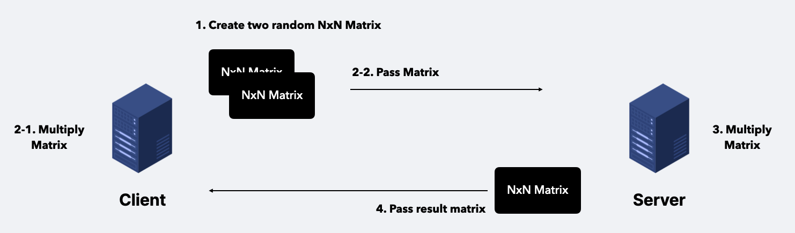
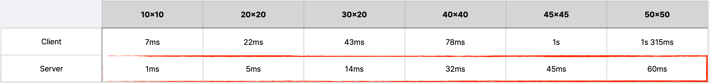
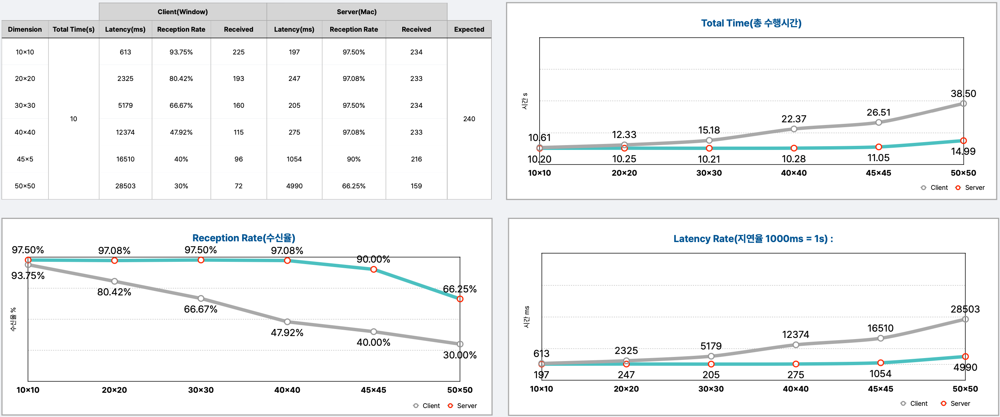
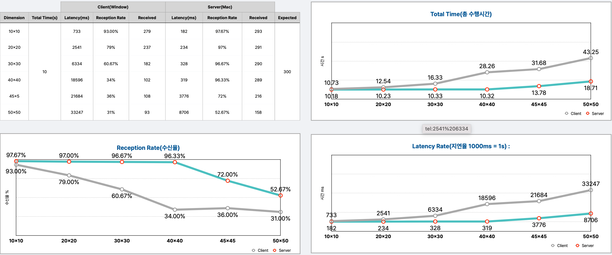
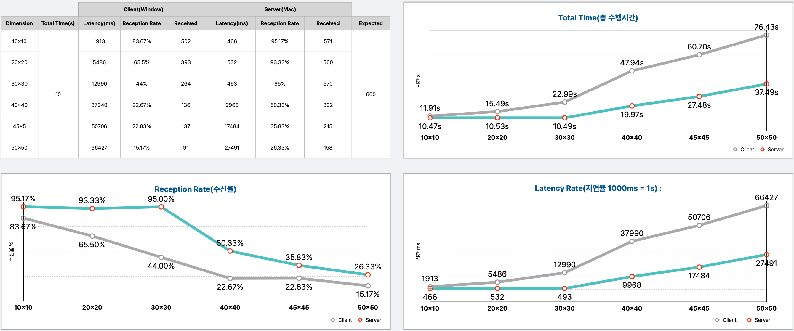

<a name="readme-top"></a>


<!-- PROJECT LOGO -->
<br />
<div align="center">
    <h2 align="center">Measuring gRPC Matrix Multiplication performance</h2>
    <h6>2022-2 KHU SW-Capstone Design Project</h6>
</div>

<br></br>


<!-- ABOUT THE PROJECT -->
## About the project
gRPC Framework is a open source high performance RPC(Remote Procedure Call) framework made by Google.  Matrix multiplication operations are performed a lot in machine learning and deep learning. Data processing can be executed by locally. But if the importance of real-time processing is low, it is better to execute matrix operation on remote PC than local PC. To make two PCs interact each other, network is required. This project aims to evaluate gRPC performance whether gRPC can provide a stable and fast network communication.

<p align="right">(<a href="#readme-top">back to top</a>)</p>

## Problem Definition
Performance is measured for 10x10, 20x20, 30x30, 40x40, 45x45, 50x50 Matrix by 24, 30, and 60 FPS during 10 seconds

<p align="right">(<a href="#readme-top">back to top</a>)</p>

## Test Environment
|      Hardware     |          OS         | Core  | RAM  |  SSD  | Network Average Speed | Network Max Speed | python version | grpcio version | grpcio-tools version |
| :---------------: | :-----------------: | :---: | :--: | :---: | :-------------------: | :---------------: | :------------: | :------------: | :------------------: |
| Macbook Pro(2020) | macOS Monterey 12.4 | M1(8) | 16GB | 256GB |        33Mbps         |      77Mbps       |     3.9.13     |     1.49.1     |       1.16.1         |
| LG Gram(2020)     | Window 9            | Intel-i7(8) | 16GB | 512GB | 33Mbps | 77Mbps | 3.9.13 | 1.49.1 | 1.16.1 |
<p align="right">(<a href="#readme-top">back to top</a>)</p>

## Test Senario

<h5 align='center'>[Figure1]</h5>
<p align="right">(<a href="#readme-top">back to top</a>)</p>

<!-- GETTING STARTED -->
## Getting Started

### 1. Installation
1. Clone the repo
   ```sh
   git clone git@github.com:isthisdan/grpc-matrix-multiplication.git
   ```
3. Install package
   ```sh
   // conda
   conda install --yes --file conda_requirements.txt
   ```
### 2. Settings
1. Define your test condition
    ```py
    # lib.py
    class ClientFpsC:
        DIMENSION = 30
        MAX_TIME = 10
        FPS = 24
    ```
### 3. Run gRPC
1. Run Server
    ```sh
    python3.9 server.py
    ```
2. Run Client
    ```sh
    python3.9 client.py
    ```
<p align="right">(<a href="#readme-top">back to top</a>)</p>

## Test Result
```
Client : LG Gram(2020)
Server : Macbook M1 Pro(2020)
``` 
### Average Time of Client & Server Matrix Multiplication

<h5 align='center'>[Figure2] Average Time of Client & Server Matrix Multiplication</h5>

### 24FPS

<h5 align='center'>[Figure3] 24FPS Matrix Multiplication Result</h5>

### 30FPS

<h5 align='center'>[Figure4] 30FPS Matrix Multiplication Result</h5>

### 60FPS

<h5 align='center'>[Figure5] 60FPS Matrix Multiplication Result</h5>

See the <a href="https://github.com/isthisdan/grpc-matrix-multiplication/tree/main/result"> Execution log</a> for more information.

<p align="right">(<a href="#readme-top">back to top</a>)</p>

### Conclusion
In **[Figure3]** **[Figure4]** **[Figure5]** , turquoise line is the result using grpc and gray line is the result not using grpc. According to the result, it is validated that the average matrix operation speed still could be faster using gRPC. Processing data should be done on remote PC when the amount of data is big. gRPC is a really good option for network connection between the local PC and remote PC.

<p align="right">(<a href="#readme-top">back to top</a>)</p>

<!-- LICENSE -->
## License
Distributed under the MIT License. See `LICENSE.txt` for more information.

<p align="right">(<a href="#readme-top">back to top</a>)</p>

<!-- CONTACT -->
## Contact
Google Mail - flydanny0511@gmail.com

<p align="right">(<a href="#readme-top">back to top</a>)</p>